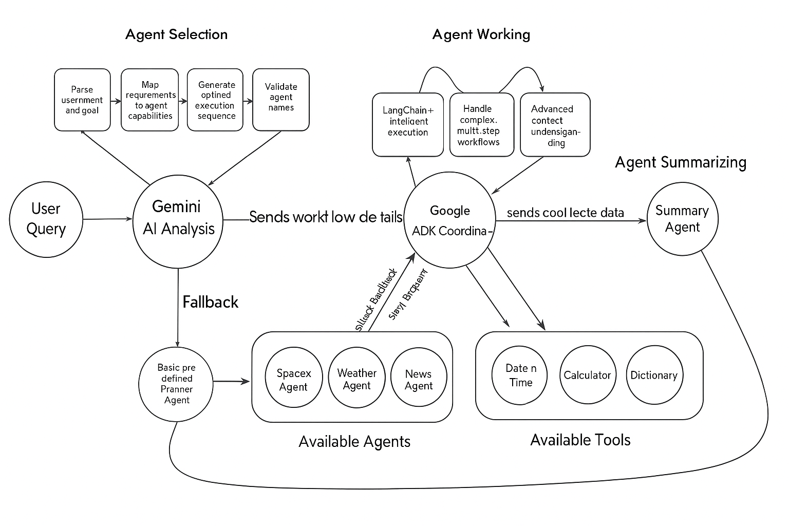
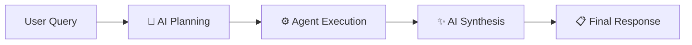
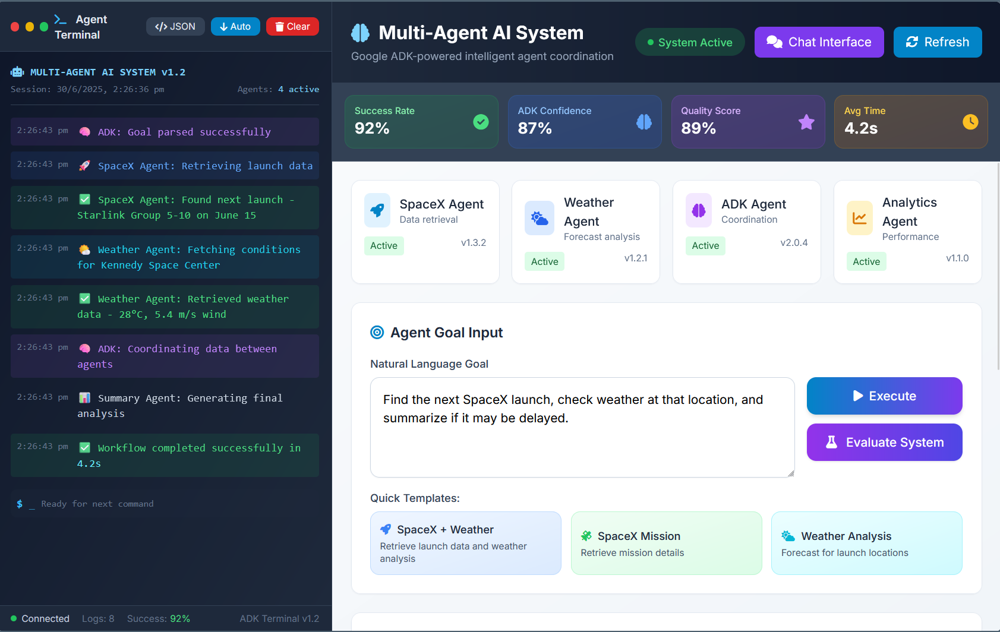

# 🤖 Multi-Agent AI 

---


ThIS Multi-Agent AI is an intelligent coordination system that translates complex user queries into streamlined workflows involving multiple specialized agents. Leveraging Google Gemini AI for strategic task decomposition, it delegates responsibilities to domain-focused agents that collaborate to solve cross-functional problems efficiently.
🌟 Use Case Illustration

User Query: "When is the next SpaceX launch, and will the weather be suitable for it?"

System Breakdown:

    🧠 Intelligent Planning: Gemini AI understands the request and assembles the agent lineup: [spacex_agent, weather_agent, summary_agent]

    🚀 SpaceX Agent: Retrieves launch details for "Starship IFT-7" and its site coordinates (Starbase, TX)

    🌦️ Weather Agent: Fetches weather conditions for the launch location (25.99°N, -97.15°W)

    📊 Summary Agent: Interprets weather metrics and assesses launch viability:
    "Wind speed at 12 mph, 25% cloud cover — favorable conditions."

    ✅ Final Response:
    "Starship IFT-7 is set to launch on June 20th from Starbase. Weather conditions are currently optimal with gentle winds and low cloud coverage — a successful launch is highly probable. 🚀

---

## 🏗️ **System Architecture**



### **🤖 Specialized Agent Fleet (7 Agents)**

| Agent | Domain | Capabilities | APIs Used |
|-------|--------|-------------|----------|
| **🚀 SpaceX** | Space Technology | Launch schedules, mission data, coordinates | SpaceX REST API |
| **🌍 Weather** | Meteorology | Location weather, launch conditions | OpenWeatherMap API |
| **📰 News** | Information | Contextual news, topic extraction | NewsAPI |
| **🔢 Calculator** | Mathematics | Advanced calculations, expressions | Built-in Engine |
| **📖 Dictionary** | Linguistics | Definitions, phonetics, etymology | Free Dictionary API |
| **💬 Summary** | Communication | Data synthesis, conversation | AI Processing |
| **🧠 ADK Coordinator** | Orchestration | Intelligent workflow planning | Google Gemini + LangChain |

### **⚡ Three-Phase Execution Model**



1. **🧠 Phase 1**: AI-powered agent selection and sequence optimization
2. **⚙️ Phase 2**: Sequential agent execution with cumulative state management  
3. **✨ Phase 3**: Intelligent final response generation with actionable insights

---

##  **Web Dashboard**




## 🚀 **Setup & Installation**

### **📋 Prerequisites**
- **Python 3.8+** (Recommended: Python 3.11+)
- **Git** for cloning the repository
- **API Keys** (see Environment Setup below)

### **⚡ Quick Start**

```bash
# 1. Clone the repository
git clone https://github.com/INSANE0777/Multi-Agent-AI-System.git
cd Multi-Agent-AI-System

# 2. Create and activate virtual environment
python -m venv venv

# Windows
venv\Scripts\activate

# macOS/Linux  
source venv/bin/activate

# 3. Install dependencies
pip install -r requirements.txt

# 4. Set up environment variables (see below)
cp .env.example .env
# Edit .env with your API keys

# 5. Run the system
python main.py
```

### **🔑 Environment Setup**

Create a `.env` file in the project root with your API keys:

```bash
# Google Gemini API (Required for AI planning)
GOOGLE_API_KEY=your_google_gemini_api_key_here

# Weather Data (Required for weather agent)
WEATHER_API_KEY=your_openweathermap_api_key_here

# News Data (Required for news agent)  
NEWS_API_KEY=your_newsapi_org_api_key_here

# LangChain Configuration
GOOGLE_GENAI_USE_VERTEXAI=FALSE
```

#### **🔗 API Key Sources**
- **Google Gemini**: [Get API Key](https://ai.google.dev/) (Free tier available)
- **OpenWeatherMap**: [Get API Key](https://openweathermap.org/api) (Free tier: 1000 calls/month)
- **NewsAPI**: [Get API Key](https://newsapi.org/) (Free tier: 1000 requests/month)

### **🎮 Running the System**

#### **Command Line Interface**
```bash
# Interactive mode with intelligent agent selection
python main.py

# Example inputs to try:
# "Get SpaceX launch and weather conditions"
# "Calculate 15% tip on $47.50"  
# "Define quantum entanglement"
# "Latest technology news"
# "Hello, what can you do?"
```

#### **Web User Interface**
```bash
# Start the web interface
python web_interface.py

# Open browser to: http://localhost:5000
# Features:
# - Real-time agent execution monitoring
# - Interactive controls and settings
# - Comprehensive result visualization
# - Agent performance metrics
```

#### **Chat Interface**  
```bash
# Start the enhanced chat interface
python start_ui.py

# Open browser to: http://localhost:5000/chat
# Features:
# - Conversational AI interaction
# - Multi-turn conversations
# - Agent status indicators
# - Real-time response streaming
```

---


## 🎯 **Use Cases & Examples**

### **🚀 Space & Weather Analysis**
```
Input: "When is the next SpaceX launch and what's the weather like?"
Output: Real-time launch data + location-specific weather + readiness analysis
```

### **📰 Contextual News Intelligence**  
```
Input: "Get news about SpaceX launches"
Output: Relevant articles + launch context + current mission correlation
```

### **🔢 Advanced Mathematics**
```
Input: "Calculate the trajectory angle for a rocket at 45° with 15% wind adjustment"  
Output: Precise calculations + formula breakdown + result interpretation
```

### **🧠 Multi-Domain Analysis**
```
Input: "SpaceX launch conditions with news updates and weather forecast"
Output: Coordinated analysis combining launch data, weather, and current news
```

### **💬 Conversational AI Assistant**
```
Input: "Hello, help me understand what you can do"
Output: Friendly explanation + capability overview + usage examples
```

---

## 🏗️ **Project Structure**

```
Multi-Agent-AI-System/
├── 🤖 agents/                   # Core agent implementations
│   ├── __init__.py              # Agent module initialization
│   ├── spacex_agent.py          # SpaceX data & coordinates
│   ├── weather_agent.py         # Weather data retrieval  
│   ├── news_agent.py            # News article fetching
│   ├── calculator_agent.py      # Mathematical computation
│   ├── dictionary_agent.py      # Word definitions & linguistics
│   ├── summary_agent.py         # Data synthesis & conversation
│   ├── google_adk_agent.py      # AI coordination & planning
│   └── planner.py               # Fallback planning system
│
├── 🌐 templates/                # Web interface templates
│   ├── index.html               # Main dashboard
│   └── chat.html                # Chat interface
│
├── 🎨 static/                   # Static assets & media
│   ├── logo.png                 # System logo
│   ├── logo.ico                 # Favicon
│   ├── styles.css, chat.css     # Styling
│   └── script.js, chat.js       # JavaScript functionality
│
├── 📚 docs/                     # Documentation & diagrams
│   ├── SYSTEM_ARCHITECTURE_DETAILED.md # Complete technical docs
│   
│   
│
├            # Testing documentation
│
├
├── ⚙️ Core Files
│   ├── main.py                  # Main CLI application
│   ├── web_interface.py         # Web dashboard server
│   ├── start_ui.py              # Chat interface server
│   ├── requirements.txt         # Python dependencies
│   ├── .env.example             # Environment template
│   └── README.md                # This documentation
└── 🔧 Configuration
    ├── .gitignore               # Git ignore rules
    └── .env                     # Environment variables (create this)
```

---
