# Multi-Agent AI System

---

## 🎯 **What This System Does**

The **Multi-Agent AI System** is an advanced orchestration platform that transforms complex user requests into coordinated multi-agent workflows. Using **Google Gemini AI** for intelligent planning and **specialized domain agents**, it can handle sophisticated tasks that require multiple data sources, sequential logic, and cross-domain analysis.

### 🚀 **Real-World Example**
**User Input**: *"Get the next SpaceX launch and check if weather conditions are good for launch"*

**System Response**:
1. **🧠 AI Planning**: Gemini AI analyzes intent → selects `[spacex_agent, weather_agent, summary_agent]`
2. **🚀 SpaceX Agent**: Fetches "Starship IFT-7" launch data + Starbase coordinates  
3. **🌍 Weather Agent**: Gets weather for Starbase (25.99°N, -97.15°W)
4. **📝 Summary Agent**: Analyzes launch readiness: *"12 mph winds, 25% clouds - excellent conditions!"*
5. **✨ AI Synthesis**: *"Starship IFT-7 is scheduled for June 20th at Starbase. Weather conditions are ideal with manageable winds and minimal cloud cover. Launch is highly likely to proceed as planned! 🚀"*

---

## 🏗️ **System Architecture**


### **🤖 Specialized Agent Fleet (7 Agents)**

| Agent | Domain | Capabilities | APIs Used |
|-------|--------|-------------|----------|
| **🚀 SpaceX** | Space Technology | Launch schedules, mission data, coordinates | SpaceX REST API |
| **🌍 Weather** | Meteorology | Location weather, launch conditions | OpenWeatherMap API |
| **📰 News** | Information | Contextual news, topic extraction | NewsAPI |
| **🔢 Calculator** | Mathematics | Advanced calculations, expressions | Built-in Engine |
| **📖 Dictionary** | Linguistics | Definitions, phonetics, etymology | Free Dictionary API |
| **💬 Summary** | Communication | Data synthesis, conversation | AI Processing |
| **🧠 ADK Coordinator** | Orchestration | Intelligent workflow planning | Google Gemini + LangChain |

### **⚡ Three-Phase Execution Model**

```mermaid
graph LR
    A[User Query] --> B[🧠 AI Planning]
    B --> C[⚙️ Agent Execution]
    C --> D[✨ AI Synthesis]
    D --> E[📋 Final Response]
```



1. **🧠 Phase 1**: AI-powered agent selection and sequence optimization
2. **⚙️ Phase 2**: Sequential agent execution with cumulative state management  
3. **✨ Phase 3**: Intelligent final response generation with actionable insights

---

## 🚀 **Setup & Installation**

### **📋 Prerequisites**
- **Python 3.8+** (Recommended: Python 3.11+)
- **Git** for cloning the repository
- **API Keys** (see Environment Setup below)

### **⚡ Quick Start**

```bash
# 1. Clone the repository
git clone https://github.com/INSANE0777/Multi-Agent-AI-System.git
cd Multi-Agent-AI-System

# 2. Create and activate virtual environment
python -m venv venv

# Windows
venv\Scripts\activate

# macOS/Linux  
source venv/bin/activate

# 3. Install dependencies
pip install -r requirements.txt

# 4. Set up environment variables (see below)
cp .env.example .env
# Edit .env with your API keys

# 5. Run the system
python main.py
```

### **🔑 Environment Setup**

Create a `.env` file in the project root with your API keys:

```bash
# Google Gemini API (Required for AI planning)
GOOGLE_API_KEY=your_google_gemini_api_key_here

# Weather Data (Required for weather agent)
WEATHER_API_KEY=your_openweathermap_api_key_here

# News Data (Required for news agent)  
NEWS_API_KEY=your_newsapi_org_api_key_here

# LangChain Configuration
GOOGLE_GENAI_USE_VERTEXAI=FALSE
```

#### **🔗 API Key Sources**
- **Google Gemini**: [Get API Key](https://ai.google.dev/) (Free tier available)
- **OpenWeatherMap**: [Get API Key](https://openweathermap.org/api) (Free tier: 1000 calls/month)
- **NewsAPI**: [Get API Key](https://newsapi.org/) (Free tier: 1000 requests/month)

### **🎮 Running the System**

#### **Command Line Interface**
```bash
# Interactive mode with intelligent agent selection
python main.py

# Example inputs to try:
# "Get SpaceX launch and weather conditions"
# "Calculate 15% tip on $47.50"  
# "Define quantum entanglement"
# "Latest technology news"
# "Hello, what can you do?"
```

#### **Web User Interface**
```bash
# Start the web interface
python web_interface.py

# Open browser to: http://localhost:5000
# Features:
# - Real-time agent execution monitoring
# - Interactive controls and settings
# - Comprehensive result visualization
# - Agent performance metrics
```

#### **Chat Interface**  
```bash
# Start the enhanced chat interface
python start_ui.py

# Open browser to: http://localhost:5000/chat
# Features:
# - Conversational AI interaction
# - Multi-turn conversations
# - Agent status indicators
# - Real-time response streaming
```

---


## 🎯 **Use Cases & Examples**

### **🚀 Space & Weather Analysis**
```
Input: "When is the next SpaceX launch and what's the weather like?"
Output: Real-time launch data + location-specific weather + readiness analysis
```

### **📰 Contextual News Intelligence**  
```
Input: "Get news about SpaceX launches"
Output: Relevant articles + launch context + current mission correlation
```

### **🔢 Advanced Mathematics**
```
Input: "Calculate the trajectory angle for a rocket at 45° with 15% wind adjustment"  
Output: Precise calculations + formula breakdown + result interpretation
```

### **🧠 Multi-Domain Analysis**
```
Input: "SpaceX launch conditions with news updates and weather forecast"
Output: Coordinated analysis combining launch data, weather, and current news
```

### **💬 Conversational AI Assistant**
```
Input: "Hello, help me understand what you can do"
Output: Friendly explanation + capability overview + usage examples
```

---

## 🏗️ **Project Structure**

```
Multi-Agent-AI-System/
├── 🤖 agents/                   # Core agent implementations
│   ├── __init__.py              # Agent module initialization
│   ├── spacex_agent.py          # SpaceX data & coordinates
│   ├── weather_agent.py         # Weather data retrieval  
│   ├── news_agent.py            # News article fetching
│   ├── calculator_agent.py      # Mathematical computation
│   ├── dictionary_agent.py      # Word definitions & linguistics
│   ├── summary_agent.py         # Data synthesis & conversation
│   ├── google_adk_agent.py      # AI coordination & planning
│   └── planner.py               # Fallback planning system
│
├── 🌐 templates/                # Web interface templates
│   ├── index.html               # Main dashboard
│   └── chat.html                # Chat interface
│
├── 🎨 static/                   # Static assets & media
│   ├── logo.png                 # System logo
│   ├── logo.ico                 # Favicon
│   ├── styles.css, chat.css     # Styling
│   └── script.js, chat.js       # JavaScript functionality
│
├── 📚 docs/                     # Documentation & diagrams
│   ├── SYSTEM_ARCHITECTURE_DETAILED.md # Complete technical docs
│   
│   
│
├── 🧪 test-scripts/             # Testing & evaluation suite
│   ├── quick_agent_test.py      # Interactive agent testing
│   ├── test_individual_agents.py # Comprehensive test suite
│   ├── test_enhanced_workflow.py # End-to-end testing
│   ├── automated_evaluation.py  # Performance evaluation
│   └── README.md                # Testing documentation
│
├── 📊 evals/                    # Evaluation data & results
│   ├── test_goals.json          # Test scenarios
│   └── evaluation_results_*.json # Performance metrics
│
├── ⚙️ Core Files
│   ├── main.py                  # Main CLI application
│   ├── web_interface.py         # Web dashboard server
│   ├── start_ui.py              # Chat interface server
│   ├── requirements.txt         # Python dependencies
│   ├── .env.example             # Environment template
│   └── README.md                # This documentation
└── 🔧 Configuration
    ├── .gitignore               # Git ignore rules
    └── .env                     # Environment variables (create this)
```

---
